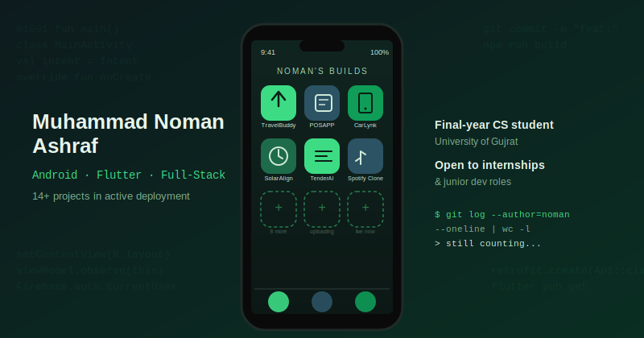

<div align="center">



<br>


</div>

<br>

> *Most profile READMEs describe a developer. This one is built like one of his apps — versioned, in progress, and shipping in public.*

<br>

## `$ whoami`

```
> Final-year CS student, University of Gujrat (2022–2026)
> Shipped: 1 paid commercial client app, 1 AI-integrated final year project
> Currently building: POSAPP — real-time, offline-first restaurant POS
> Uploading 14+ projects to this profile, one repo at a time — track progress below
> Looking for: Android / Flutter / Full-Stack internship or junior role
```

<br>

## 📦 Project upload tracker

This isn't a static list — it's a live build log. Every project below started as a finished app on my machine; each gets its own repo, real source code, and a README written from how the app actually works (not boilerplate).

<table>
<tr>
<th align="left">Status</th>
<th align="left">Project</th>
<th align="left">Stack</th>
<th align="left">What it does</th>
</tr>
<tr>
<td>✅ Live</td>
<td><b>Blood Bank Management System</b></td>
<td><code>C++</code></td>
<td>Console CRUD app for donor & blood stock records, file-based storage</td>
</tr>
<tr>
<td>✅ Live</td>
<td><b>Balloon Shooting Game</b></td>
<td><code>x86 Assembly</code></td>
<td>Real-time arcade game using direct video memory writes & BIOS interrupts</td>
</tr>
<tr>
<td>🔜 Uploading</td>
<td><b>TravelBuddy</b> — Final Year Project</td>
<td><code>Kotlin</code> <code>Gemini AI</code> <code>Firebase</code></td>
<td>AI ride-sharing app: live GPS tracking, fare engine, KYC, SOS safety suite</td>
</tr>
<tr>
<td>🔜 Uploading</td>
<td><b>POSAPP</b></td>
<td><code>Kotlin</code> <code>Node.js</code> <code>Socket.IO</code></td>
<td>Multi-device restaurant POS — real-time sync across waiter/kitchen/admin</td>
</tr>
<tr>
<td>🔜 Uploading</td>
<td><b>CarLynk</b></td>
<td><code>Flutter</code> <code>Riverpod</code> <code>Firebase</code></td>
<td>Privacy-first anonymous vehicle-owner messaging via QR codes</td>
</tr>
<tr>
<td>🔜 Uploading</td>
<td><b>SolarAlign</b></td>
<td><code>Kotlin</code> <code>SQLCipher</code> <code>SensorManager</code></td>
<td>Sensor-fusion tilt/azimuth capture tool for solar installers</td>
</tr>
<tr>
<td>🔜 Uploading</td>
<td><b>AI Tender Analyzer</b></td>
<td><code>React</code> <code>FastAPI</code> <code>Gemini AI</code></td>
<td>Parses tender PDFs/DOCX into structured risk & eligibility summaries</td>
</tr>
<tr>
<td>🔜 Uploading</td>
<td><b>Spotify Clone</b></td>
<td><code>React</code> <code>MongoDB</code> <code>Socket.IO</code></td>
<td>Full-stack streaming app with real-time chat & custom audio player</td>
</tr>
<tr>
<td>🔜 Uploading</td>
<td><b>Mr. Burger POS</b> — Paid client work</td>
<td><code>PHP</code> <code>MySQL</code></td>
<td>Local POS system delivered to a fast-food client, offline-capable</td>
</tr>
<tr>
<td>🔜 Uploading</td>
<td><b>+ 6 more academic & personal projects</b></td>
<td><code>C#</code> <code>Java</code> <code>Python</code></td>
<td>RMS desktop app, console messaging app, ERD design, CNN face-matching, and more</td>
</tr>
</table>

<div align="center">
<sub>⭐ Star this repo or check back — this table updates as each project goes live.</sub>
</div>

<br>

## 🧠 How I actually build things

Not a skills list — a description of how each layer gets used in practice.

<table>
<tr>
<td width="33%" valign="top">

### 📱 Mobile
Native Android in **Kotlin** with MVVM, Room, Retrofit, and Jetpack Compose. Cross-platform work in **Flutter/Dart** with Riverpod and GoRouter when one codebase needs to ship on both platforms fast.

</td>
<td width="33%" valign="top">

### ⚙️ Backend
**Node.js/Express** and **FastAPI** for APIs, with **Socket.IO** whenever a project needs live sync — restaurant orders, GPS positions, chat — rather than polling.

</td>
<td width="33%" valign="top">

### 🗄️ Data
**Firebase** for fast-moving mobile backends, **MySQL/MongoDB** when relational or document structure actually matters, and local **SQLite/Room** with SQLCipher for offline-first, encrypted-at-rest apps.

</td>
</tr>
</table>

<br>

## 📊 The numbers

<div align="center">
<table>
<tr>
<td>


</td>
<td>


</td>
</tr>
</table>


</div>

<br>

## 🛣️ What's next

A clickable portfolio site is in the works — built from scratch (not a template), where you can open each app and walk through real screens instead of just reading about them. It'll go live once the project repos above are filled in with real screenshots and demos.

<br>

<div align="center">

### 📫 Let's talk

<a href="https://www.linkedin.com/in/muhammad-noman-ashraf-7b0871210"></a>
<a href="mailto:nomanashraf339@gmail.com"></a>
<a href="https://github.com/noman-code-droid"></a>

<sub>If you read this far, you're exactly the kind of person I'd want reviewing my code. Let's talk.</sub>

</div>
